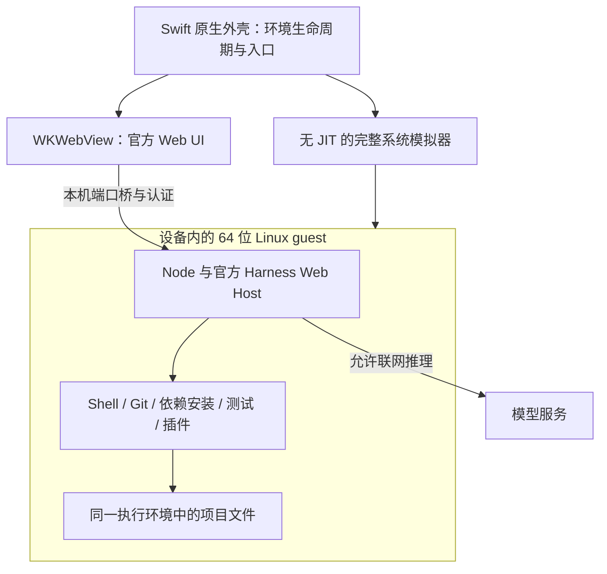

# iPad 本地执行架构基线

状态：2026-10-02 用户确认，选定作为原型验证基线；尚未构建或真机验收。对应 [决策：满足本地执行约束的 Harness 架构与语言怎么选？](https://github.com/lvivvde/deepseek-harness-ipad/issues/5)。

## 已确认约束

普通未越狱 iPad，使用者自行签名 IPA；项目文件、Git、开发工具和受支持插件在设备本地执行；允许联网调用模型。首版可限定兼容范围，但要完成获取、修改、验证与提交的本地闭环。

## 候选比较

以下为根据研究证据提出的架构推断，尚无本项目真机验证。三条路线均需要 iPad 原生宿主；UI 是否沿用官方 Web 界面可以独立于执行环境讨论。

| 路线 | 如何承载 Harness 和项目工具 | 复用机会 | 主要代价与验证门槛 |
| --- | --- | --- | --- |
| A：适配 iPad 宿主 | 嵌入 JS/Node 类运行时，保留官方核心组成；将文件、Git、命令和隔离能力连接到 iPad 宿主实现 | 官方逻辑、Web UI、服务接口及精选插件 | 需解决现代运行时版本和原生依赖，逐项替换进程工具；首版不自动具备通用 shell/npm 命令兼容性 |
| B：用户态 Linux 模拟 | 类似 iSH，在模拟的 Linux 用户态中运行工具，通过桥接连接 iPad 文件和 UI | Linux shell、guest 进程/PTY 和部分包生态 | iSH 的 i386 指令与系统调用兼容性；现代 Node/Harness 及性能仍需实测 |
| C：完整系统模拟 | 类似 UTM SE，用无 JIT 解释执行的 guest 系统运行 Harness 和工具 | 可能保留更多 Linux 运行方式 | guest 系统、磁盘和网络桥接的额外复杂度；性能、内存和中断恢复未知 |

## 研究给出的事实

- 官方能力可通过 provider 更换；文件和子进程 provider 应指向同一个执行环境。产品各部分都是 Cordis 插件，因此“保留核心”指保留相关官方实现及其行为，而不是存在一个不可替换的单体内核。[固定官方架构](https://github.com/deepseek-ai/deepseek-harness/blob/639ed015397290b3745d163aafe02ffee4aa3f84/docs/architecture.md)
- 研究基线 Harness 需要 Node `^22.19.0 || >=24.0.0`；研究基线 nodejs-mobile 为 Node 18.20，默认无 JIT。它不能直接作为满足此版本要求的已验证运行时。[官方 manifest](https://github.com/deepseek-ai/deepseek-harness/blob/639ed015397290b3745d163aafe02ffee4aa3f84/package.json)、[移动 Node 版本](https://github.com/nodejs-mobile/nodejs-mobile/blob/d9552e0e01ed5bdbe12a31d1ce6c0877a4f39580/src/node_version.h)
- nodejs-mobile 文档明确限制新建进程 API，并要求 Node 在自己的线程中运行，与 WebView 通过通信机制连接。兼容 npm 模块的文档不能证明设备端任意安装、生命周期脚本或测试命令可用。[固定 FAQ](https://github.com/nodejs-mobile/nodejs-mobile/blob/d9552e0e01ed5bdbe12a31d1ce6c0877a4f39580/doc_mobile/FAQ.md)
- iSH 提供模拟层 fork/exec/PTY，但这不能证明现代 Node 可运行；UTM SE 提供无 JIT 的完整系统模拟候选，但这不能证明生产性能达标。[本地运行研究](https://github.com/lvivvde/deepseek-harness-ipad/blob/ad32c6fbeda2e6febfcf4af0625ed350de9cac1e/docs/research/ipad-local-runtime.md)

## 已确认的用户偏好

- 首版必须具备 Linux 式 shell 和子进程。
- 优先保持上游运行方式，接受模拟环境的代价。
- 沿用官方 Web UI 做触控适配，原生外壳负责环境管理。

## 已选验证路线：完整系统模拟

上述偏好选择 C。iSH 的用户态兼容边界会给新版 Node/原生模块增加验证问题；完整 64 位 Linux guest 更符合保持上游运行方式的目标。性能和 Harness 兼容性仍未验证，选择基线不代表生产能力已通过。

确定分层：Swift/SwiftUI 原生宿主管理执行环境生命周期与文件入口；WKWebView 承载官方 React/TypeScript 界面；UTM SE/QEMU 无 JIT 软件模拟承载 64 位 aarch64 Linux；Linux 内运行匹配官方版本要求的 Node、dsh Web profile、shell/Git/依赖与测试工具。项目文件与开发命令指向同一个 guest 执行环境。

网页通过仅对设备本机开放的端口桥访问 guest 的认证 Harness Host；guest 的监听地址、端口转发、流式响应与访问凭据需原型验证。原生宿主不另行创建一套和 guest 不一致的项目执行目录。Files 与 guest 磁盘之间的工作区语义留给工作区决策票。

[研究：UTM SE 能否嵌入自有 IPA 并承载上游 Harness？](https://github.com/lvivvde/deepseek-harness-ipad/issues/10) 已核实主候选有解释器、64 位 guest、共享库桥、hostfwd 与 serial/QMP 的源码入口。固定 UTM 基线为 `7eadb056ae0f91d979059544d0ddcd2d5a40be92`，其修改 QEMU 基线为 `v10.0.12-utm`；它们不是最新稳定版承诺。UTM 的旧许可证清单与当前依赖不同，实际发布清单需从保留组件和链接方式重建。[不可变研究资产](https://github.com/lvivvde/deepseek-harness-ipad/blob/b33c140a853f93763705971bb02c5ffc839d39e7/docs/research/utm-se-embedding.md)

用户已确认采用这条优先验证路线，并接受裁剪/适配 UTM 桥接层及按实际组件许可提供对应源码、补丁与所需构建/重链接资料。Node/Harness、网页桥接和性能仍未通过真机验证。

### 技术职责与维护边界

| 部分 | 选定基线 | 维护边界 |
| --- | --- | --- |
| iPad 应用与环境生命周期 | Swift/SwiftUI，按需调用 UIKit | 启停、进度、任务中断恢复、签名后权限与系统入口 |
| 用户界面 | WKWebView + 官方 React/TypeScript Web UI | 触控/键盘适配、认证本机连接；避免重写会话协议 |
| 系统执行器 | UTM SE 的无 JIT QEMU 构建方向；原生桥接层按实际依赖使用 Objective-C/C/C++ | 不是复制一个已验证 SDK；需维护所采用的桥接、构建与补丁 |
| guest 系统 | 完整 64 位 Linux，首先评估 aarch64 | 首版以终端和 Harness 服务为中心，图形 Linux 桌面不作为必需组件 |
| Harness 与项目工具 | Linux 内的官方 Node、dsh profile 和对应工具链 | 上游基线为 dsh 0.2.0-rc.2；先对齐其固定 Node 24.21.0，再按实际兼容性选项目依赖；版本数字不是设备测试结果 |

先采用完整系统模拟的基础路线，同时按真实构建依赖核查哪些图形/音视频组件可移除；尚未证明可以消除任何许可证义务。公开对应组件源码、补丁与所需构建/重链接资料，具体发布清单在采用的构建确定后核验。

### 必须先通过的技术门槛

1. 自有、普通重签 IPA 在无 JIT helper 条件下启动 64 位 Linux guest；记录冷启动、磁盘、内存与系统条件。
2. guest 启动匹配版本 Node 和固定官方 Harness；运行 shell 子进程及 PTY，并核实原生模块和官方 sandbox 探测结果。
3. WKWebView 通过本机端口桥完成认证、会话、流式响应及工具输出；回调地址、来源检查和连接恢复分别验证。
4. 在 guest 内完成一个真实小项目的获取、依赖安装、修改、测试与 Git 提交；具体项目和性能阈值由下一张首版闭环决策票确定。

任何门槛失败都保留准确错误并回到选型讨论。Linux 环境可启动不等于官方工具隔离、插件、登录和生产性能全部兼容。

最小执行层与界面桥接由 [原型：无 JIT 自签 IPA 能启动 Linux、官方 Harness 并连通界面吗？](https://github.com/lvivvde/deepseek-harness-ipad/issues/11) 验证；该票通过后，再确定首版项目闭环与性能阈值。

## 决策纪律

原生宿主、Harness 运行时和项目工具运行时分别列出；任何路径都以设备内执行验收。用文件编辑展示替代不了依赖安装、真实测试与 Git 提交。若现代运行时验证失败，重新讨论架构选择；不把 Node 18、远端工具执行或简单 WebView 页面当作已通过当前目标的替代物。
